# 🧠 Totem IA — Sprint 2
**Integração: Sensores → SQL → Analytics → Machine Learning**
*Flexmedia Challenge — FIAP*

__________________________________________________________________________

## 📌 1. Introdução

A Sprint 2 representa a primeira etapa prática da implementação do Totem IA, conectando coleta de dados simulados, armazenamento estruturado, tratamento, análise, visualização e aprendizado de máquina supervisionado.

Tudo foi construído com base no planejamento arquitetural da Sprint 1, tornando esta entrega um protótipo funcional real que demonstra:
1.  Como o totem coleta informações do mundo físico (Simulação).
2.  Como essas informações são estruturadas e armazenadas (SQL).
3.  Como são transformadas em inteligência (Machine Learning).
4.  Como são visualizadas para tomada de decisão (Dashboard).

## 🎯 2. Objetivos da Sprint 2

✔ Demonstrar integração entre sensores/simulações e banco SQL.
✔ Registrar dados brutos e eventos de interação.
✔ Criar dashboard com métricas iniciais em tempo real.
✔ Realizar análises estatísticas descritivas.
✔ Treinar um modelo supervisionado (Random Forest) para classificar toques.
✔ Garantir organização e limpeza dos dados.
✔ Representar claramente todo o fluxo do pipeline.

## 🧱 3. Arquitetura Implementada

A arquitetura prática desenvolvida nesta sprint segue o fluxo:

```mermaid
flowchart TD
    A[Sensores Simulados<br>sensor_sim.py] -->|Gera CSV| B[Dados Brutos<br>sample_interactions.csv]
    B --> C[Ingestão SQL<br>ingest_to_sql.py]
    C -->|Persiste| D[Banco SQLite<br>flexmedia.sqlite]
    D --> E[Análise e ML<br>analysis.py / ml_train.py]
    E -->|Gera| F[Relatórios e Gráficos<br>media/*.png]
    D -->|Consulta| H[Dashboard Front-end<br>Streamlit]
```

## 🧬 4. Fluxo de Dados Completo

O fluxo descreve a jornada do dado desde a captura até a inteligência:

```mermaid
sequenceDiagram
    participant S as Sensor Simulado
    participant CSV as CSV Bruto
    participant SQL as Banco SQLite
    participant A as Script Análise
    participant ML as Machine Learning
    participant D as Dashboard

    S->>CSV: Registra evento (Touch, Presence, QR)
    CSV->>SQL: Ingestão e normalização
    SQL->>A: Carregamento para limpeza
    A->>A: Tratamento e estatísticas
    SQL->>ML: Carrega dados de duração
    ML->>ML: Treina modelo (Random Forest)
    SQL->>D: Fornece dados em tempo real
```

## 🗄️ 5. Modelo de Dados (DER)

O banco de dados SQLite possui duas tabelas principais relacionadas:

erDiagram
    SESSAO {
        string id PK "Identificador único da sessão"
        string idioma "Idioma escolhido"
        string inicio "Timestamp inicial"
    }

    INTERACAO {
        int id PK "Auto-incremental"
        string sessao_id FK "Vínculo com a sessão"
        string timestamp "Hora exata do evento"
        string sensor_id "Qual sensor ativou"
        string tipo "touch, presence ou qr"
        float duration "Duração em segundos"
        int value "Valor binário do sensor"
    }

    SESSAO ||--|{ INTERACAO : "contém"

## 📁 6. Estrutura do Repositório

TotemIA_Sprint2/
│
├── data/                    # Armazenamento de dados (CSV, SQLite, JSON)
├── media/                   # Gráficos estáticos gerados para relatórios
├── sensor_sim.py            # 1. Simulador de Sensores (Gêmeo Digital)
├── ingest_to_sql.py         # 2. Script de Ingestão e Estruturação SQL
├── analysis.py              # 3. Análise Descritiva e Geração de Gráficos
├── ml_train.py              # 4. Treinamento de Machine Learning (Random Forest)
├── dashboard_streamlit.py   # 5. Dashboard Interativo (Front-end)
└── README.md                # Documentação do Projeto

## 🧩 7. Códigos Fonte (Implementação Real)

Abaixo estão os códigos finais utilizados no projeto, corrigidos e validados.

7.1. Simulador de Sensores (sensor_sim.py)
Gera dados sintéticos simulando o hardware físico.

import csv, time, random, uuid
from datetime import datetime
import os

CSV_OUT = 'data/sample_interactions.csv'

def random_interaction(session_id):
    sensor = random.choice(['touch_1','touch_2','pres_1'])
    event = random.choices(['touch','presence','qr'], weights=[0.7,0.25,0.05])[0]
    duration = round(random.uniform(0.05,4.0) if event=='touch' else 0.0,3)
    value = 1 if event in ('touch','presence') else 0
    lang = random.choices(['pt-BR','en-US','es-ES'], weights=[0.7,0.2,0.1])[0]
    content_id = str(uuid.uuid4()) if random.random() < 0.6 else None

    pergunta, resposta = None, None
    if event == 'touch' and random.random() < 0.4:
        pergunta = random.choice(["Qual é esse animal?","Horário?","Onde fica o banheiro?"])
        resposta = "Resposta simulada."

    return {
        'timestamp': datetime.now().isoformat(),
        'sensor_id': sensor,
        'event_type': event,
        'duration': duration,
        'value': value,
        'session_anon_id': session_id,
        'language': lang,
        'content_id': content_id,
        'pergunta': pergunta,
        'resposta': resposta
    }

if __name__ == '__main__':
    os.makedirs('data', exist_ok=True)
    with open(CSV_OUT, 'w', newline='', encoding='utf-8') as f:
        writer = None
        for s in range(50):
            session_id = str(uuid.uuid4())
            for i in range(random.randint(3,20)):
                row = random_interaction(session_id)
                if writer is None:
                    writer = csv.DictWriter(f, fieldnames=list(row.keys()))
                    writer.writeheader()
                writer.writerow(row)
                time.sleep(0.01)
    print('CSV gerado:', CSV_OUT)

7.2. Ingestão de Dados SQL (ingest_to_sql.py)
Realiza a leitura do CSV e a persistência em banco relacional.

import sqlite3, csv
import os

DB = 'data/flexmedia.sqlite'
CSV = 'data/sample_interactions.csv'

SCHEMA = '''
CREATE TABLE IF NOT EXISTS sessao (
  id TEXT PRIMARY KEY, idioma TEXT, inicio TEXT, fim TEXT, duracao_seconds INTEGER
);
CREATE TABLE IF NOT EXISTS interacao (
  id INTEGER PRIMARY KEY AUTOINCREMENT, sessao_id TEXT, timestamp TEXT, sensor_id TEXT,
  tipo TEXT, pergunta TEXT, resposta TEXT, content_id TEXT, duration REAL, value INTEGER
);
CREATE INDEX IF NOT EXISTS idx_interacao_sessao ON interacao(sessao_id);
'''

def ingest(csv_path, db_path):
    if not os.path.exists(csv_path):
        print(f"ERRO: Arquivo {csv_path} não encontrado.")
        return

    conn = sqlite3.connect(db_path)
    cur = conn.cursor()
    cur.executescript(SCHEMA)

    with open(csv_path, newline='', encoding='utf-8') as f:
        reader = csv.DictReader(f)
        count = 0
        for row in reader:
            sess_id = row['session_anon_id']
            # Inserir Sessão
            cur.execute('SELECT id FROM sessao WHERE id=?',(sess_id,))
            if cur.fetchone() is None:
                cur.execute('INSERT INTO sessao (id, idioma, inicio) VALUES (?,?,?)',
                            (sess_id, row['language'], row['timestamp']))
            # Inserir Interação
            cur.execute('''INSERT INTO interacao 
                (sessao_id, timestamp, sensor_id, tipo, pergunta, resposta, content_id, duration, value)
                VALUES (?,?,?,?,?,?,?,?,?)''',
                (sess_id, row['timestamp'], row['sensor_id'], row['event_type'], 
                 row['pergunta'], row['resposta'], row['content_id'], 
                 float(row['duration']), int(row['value'])))
            count += 1

    conn.commit()
    conn.close()
    print(f"Ingestão concluída. {count} registros inseridos.")

if __name__ == "__main__":
    ingest(CSV, DB)

7.3. Análises Estatísticas (analysis.py)
Gera gráficos estáticos e relatórios de resumo.

import sqlite3
import pandas as pd
import matplotlib.pyplot as plt
import os
import json

DB = 'data/flexmedia.sqlite'

def run_analysis():
    if not os.path.exists(DB): return
    conn = sqlite3.connect(DB)
    df = pd.read_sql_query('SELECT * FROM interacao', conn, parse_dates=['timestamp'])
    conn.close()

    if df.empty: return
    df = df.drop_duplicates(subset=['timestamp','sensor_id','tipo'])
    
    df['touch_type'] = df['duration'].apply(lambda d: 'none' if d==0 else ('short' if d <= 0.5 else 'long'))
    os.makedirs('media', exist_ok=True)

    plt.figure()
    df['tipo'].value_counts().plot(kind='bar', color='skyblue')
    plt.title('Interações por Tipo')
    plt.tight_layout()
    plt.savefig('media/interacoes_por_tipo.png')
    plt.close()

    report = {
        "total_interacoes": len(df),
        "interacoes_por_tipo": df['tipo'].value_counts().to_dict(),
        "duracao_media": float(df['duration'].mean() or 0)
    }
    with open('data/report_summary.json','w',encoding='utf-8') as f:
        json.dump(report, f, indent=2, ensure_ascii=False)
    print("Análises concluídas.")

if __name__ == "__main__":
    run_analysis()

7.4. Machine Learning (ml_train.py)
Treina modelo para classificar toques acidentais vs intencionais.

import sqlite3
import pandas as pd
from sklearn.model_selection import train_test_split
from sklearn.ensemble import RandomForestClassifier
from sklearn.metrics import classification_report, accuracy_score
import os

DB = "data/flexmedia.sqlite"

def train_model():
    if not os.path.exists(DB): return
    conn = sqlite3.connect(DB)
    df = pd.read_sql_query("SELECT duration FROM interacao WHERE duration > 0", conn)
    conn.close()

    if len(df) < 10: return

    # Label: 1 se > 0.5s (Intencional), 0 se <= 0.5s (Acidental)
    df['label'] = (df['duration'] > 0.5).astype(int)
    
    X_train, X_test, y_train, y_test = train_test_split(df[['duration']], df['label'], test_size=0.3, random_state=42)
    
    clf = RandomForestClassifier(n_estimators=50, random_state=42)
    clf.fit(X_train, y_train)
    
    y_pred = clf.predict(X_test)
    print(f"Acurácia do Modelo: {accuracy_score(y_test, y_pred):.2f}")
    print(classification_report(y_test, y_pred))

if __name__ == "__main__":
    train_model()

7.5. Dashboard Interativo (dashboard_streamlit.py)
Painel de controle visual.

import streamlit as st
import sqlite3
import pandas as pd
import os

st.set_page_config(page_title="Totem IA - Analytics", layout="wide")
DB = "data/flexmedia.sqlite"

st.title("📊 Dashboard Totem IA — Sprint 2")
st.markdown("---")

if not os.path.exists(DB):
    st.error("Banco de dados não encontrado.")
    st.stop()

conn = sqlite3.connect(DB)
df = pd.read_sql_query("SELECT * FROM interacao", conn, parse_dates=['timestamp'])
conn.close()

# Filtros
st.sidebar.header("Filtros")
tipos = st.sidebar.multiselect("Filtrar por Tipo", df['tipo'].unique(), df['tipo'].unique())
df_filtrado = df[df['tipo'].isin(tipos)]

# KPIs
c1, c2, c3 = st.columns(3)
c1.metric("Total de Interações", len(df_filtrado))
c2.metric("Duração Média", f"{df_filtrado['duration'].mean():.2f}s")
c3.metric("Idiomas Detectados", df_filtrado['idioma'].nunique() if 'idioma' in df_filtrado else 0)

# Gráficos
c_graf1, c_graf2 = st.columns(2)
with c_graf1:
    st.subheader("Interações por Tipo")
    st.bar_chart(df_filtrado['tipo'].value_counts())
with c_graf2:
    st.subheader("Evolução no Tempo")
    if not df_filtrado.empty:
        st.line_chart(df_filtrado.set_index('timestamp')['duration'])

st.subheader("📋 Últimas 20 Interações")
st.dataframe(df_filtrado.sort_values('timestamp', ascending=False).head(20), width='stretch')

## 📊 8. Prints das Execuções

Geração do CSV:
CSV gerado: data/sample_interactions.csv

Ingestão SQL:
Ingestão concluída. 543 registros inseridos.

Machine Learning:
Acurácia do Modelo: 1.00
              precision    recall  f1-score   support
           0       1.00      1.00      1.00        42
           1       1.00      1.00      1.00       105
    accuracy                           1.00       147

Dashboard:
You can now view your Streamlit app in your browser.
Local URL: http://localhost:8501

## 🚀 9. Como Executar o Projeto
1. Pré-requisitos: Python 3.12 (ou superior).

2. Instalação das dependências:
pip install pandas streamlit matplotlib scikit-learn

3. Execução do Pipeline (na ordem):
python sensor_sim.py          # 1. Gera os dados
python ingest_to_sql.py       # 2. Salva no banco
python ml_train.py            # 3. Treina a IA
python analysis.py            # 4. Gera relatórios estáticos

4. Iniciar Dashboard:
streamlit run dashboard_streamlit.py
